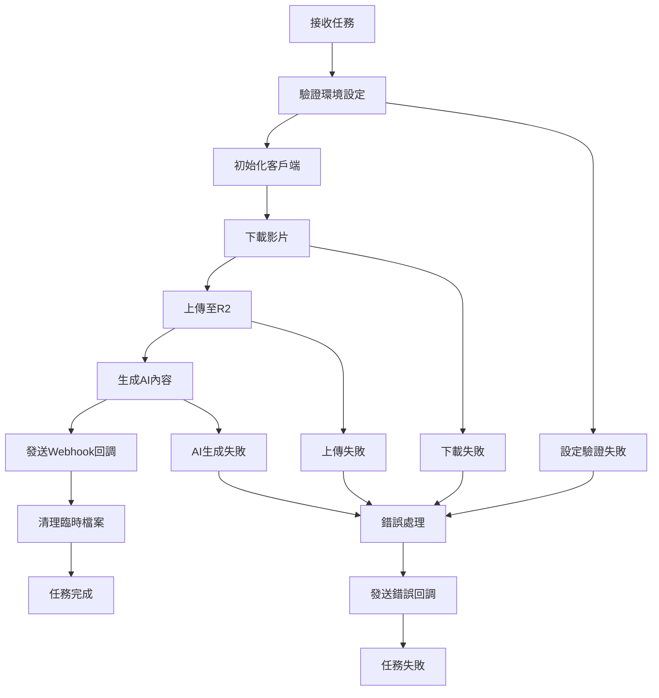

# 短影音自動化處理系統 v2.1

基於NOTION標題結構優化的短影音自動化處理系統，支援影片下載、AI內容生成、雲端儲存等功能。

## 🚀 系統特色

### ✨ 核心功能
- **自動影片下載**: 支援多平台影片下載 (YouTube, TikTok, Instagram 等)
- **AI內容生成**: 使用 OpenAI GPT-4 生成標題、標籤、內容摘要
- **雲端儲存**: 自動上傳至 Cloudflare R2 儲存
- **Webhook回調**: 完成後自動通知 n8n 工作流程
- **結構化日誌**: 使用 structlog 提供詳細的處理日誌

### 🔧 系統優化
- **設定管理**: 統一的設定檔案管理系統
- **錯誤處理**: 完善的重試機制和錯誤捕獲
- **資料結構**: 使用 dataclass 確保資料一致性
- **效能優化**: 並行處理和資源管理
- **安全性**: 環境變數和秘鑰管理

## 📋 系統需求

### Python 版本
- Python 3.11 或更高版本

### 系統相依套件
```bash
# Ubuntu/Debian
sudo apt-get install ffmpeg libavcodec-extra libmagic1 mediainfo

# macOS
brew install ffmpeg libmagic mediainfo

# Windows
# 請下載 FFmpeg 並加入 PATH
```

### Python 套件
```bash
pip install -r requirements.txt
```

## ⚙️ 環境設定

### 必要環境變數

#### 任務基本資訊
```bash
VIDEO_URL=https://example.com/video          # 影片URL
TASK_NAME=我的短影音任務                      # 任務名稱
RESPONSIBLE_PERSON=張三                       # 負責人
PHOTOGRAPHER=李四                            # 攝影師
SHOOT_DATE=2025-01-15                        # 拍攝日期
GSHEET_ROW_INDEX=5                           # Google Sheets 行索引
```

#### API 設定
```bash
OPENAI_API_KEY=sk-xxx...                     # OpenAI API 金鑰
```

#### Cloudflare R2 設定
```bash
R2_ACCOUNT_ID=your_account_id                # R2 帳戶ID
R2_ACCESS_KEY=your_access_key                # R2 存取金鑰
R2_SECRET_KEY=your_secret_key                # R2 秘密金鑰
R2_BUCKET=your_bucket_name                   # R2 儲存桶名稱
R2_CUSTOM_DOMAIN=cdn.example.com             # R2 自訂網域 (可選)
```

#### Webhook 設定
```bash
N8N_WEBHOOK_URL=https://n8n.example.com/webhook/xxx  # n8n Webhook URL
N8N_WEBHOOK_SECRET=your_secret                        # Webhook 秘鑰 (可選)
```

### 可選環境變數

#### 進階設定
```bash
OPENAI_MODEL=gpt-4o-mini                     # OpenAI 模型 (預設: gpt-4o-mini)
MAX_FILE_SIZE=104857600                      # 最大檔案大小 (位元組, 預設: 100MB)
MAX_DURATION=600                             # 最大影片長度 (秒, 預設: 10分鐘)
```

## 🏗️ 系統架構

### 檔案結構
```
短影音自動化處理系統/
├── process_task.py          # 主程式
├── config.py               # 設定檔案
├── requirements.txt        # Python 相依套件
├── .github/
│   └── workflows/
│       └── process_video.yml  # GitHub Actions 工作流程
├── logs/                   # 日誌檔案
│   └── process_task.log
└── README.md              # 說明文件
```

### 處理流程


## 🚀 使用方式

### 1. 本地執行
```bash
# 設定環境變數
export VIDEO_URL="https://www.youtube.com/watch?v=example"
export TASK_NAME="我的測試任務"
export RESPONSIBLE_PERSON="測試人員"
export PHOTOGRAPHER="攝影師"
export SHOOT_DATE="2025-01-15"
export GSHEET_ROW_INDEX="1"
export OPENAI_API_KEY="your_openai_key"
# ... 其他環境變數

# 執行程式
python process_task.py
```

### 2. GitHub Actions 觸發

#### Repository Dispatch 方式
```bash
curl -X POST \
  -H "Accept: application/vnd.github.v3+json" \
  -H "Authorization: token YOUR_GITHUB_TOKEN" \
  https://api.github.com/repos/YOUR_USERNAME/YOUR_REPO/dispatches \
  -d '{
    "event_type": "process_video",
    "client_payload": {
      "video_url": "https://www.youtube.com/watch?v=example",
      "task_name": "我的短影音任務",
      "responsible_person": "張三",
      "photographer": "李四",
      "shoot_date": "2025-01-15",
      "gsheet_row_index": "5"
    }
  }'
```

#### Workflow Dispatch 方式
1. 前往 GitHub Repository 的 Actions 頁面
2. 選擇 "短影音自動化處理系統" workflow
3. 點擊 "Run workflow"
4. 填入必要參數並執行

### 3. n8n 工作流程整合
```json
{
  "nodes": [
    {
      "parameters": {
        "method": "POST",
        "url": "https://api.github.com/repos/YOUR_USERNAME/YOUR_REPO/dispatches",
        "authentication": "predefinedCredentialType",
        "nodeCredentialType": "githubApi",
        "headers": {
          "Accept": "application/vnd.github.v3+json"
        },
        "body": {
          "event_type": "process_video",
          "client_payload": {
            "video_url": "={{ $json.video_url }}",
            "task_name": "={{ $json.task_name }}",
            "responsible_person": "={{ $json.responsible_person }}",
            "photographer": "={{ $json.photographer }}",
            "shoot_date": "={{ $json.shoot_date }}",
            "gsheet_row_index": "={{ $json.gsheet_row_index }}"
          }
        }
      },
      "type": "n8n-nodes-base.httpRequest",
      "name": "觸發影片處理"
    }
  ]
}
```

## 📊 輸出格式

### 成功回調格式
```json
{
  "status": "success",
  "task_id": "task_20250115_120000_abc12345",
  "task_name": "我的短影音任務",
  "gsheet_row_index": "5",
  "processed_time": "2025-01-15T12:05:30.123456",
  "processor_version": "v2.1",
  "task_data": {
    "任務名稱": "我的短影音任務",
    "負責人": "張三",
    "攝影師": "李四",
    "拍攝日期": "2025-01-15",
    "原始連結": "https://www.youtube.com/watch?v=example",
    "gsheet_row_index": "5",
    "task_id": "task_20250115_120000_abc12345"
  },
  "video_info": {
    "title": "原始影片標題",
    "duration": 180,
    "uploader": "上傳者名稱",
    "extractor": "youtube",
    "file_size": 52428800,
    "video_file": "/tmp/video_file.mp4",
    "thumbnail_file": "/tmp/thumbnail.jpg"
  },
  "r2_data": {
    "video_url": "https://cdn.example.com/videos/2025/01/15/task_xxx_video.mp4",
    "thumbnail_url": "https://cdn.example.com/thumbnails/2025/01/15/task_xxx_thumb.jpg",
    "r2_path": "videos/2025/01/15/task_xxx_video.mp4",
    "bucket": "my-bucket",
    "upload_time": "2025-01-15T12:05:00.000Z"
  },
  "ai_content": {
    "標題建議": [
      "超精彩！必看的短影音內容",
      "這個影片太厲害了！",
      "2025年最火的短影音",
      "不看會後悔系列",
      "網友狂推的神片"
    ],
    "內容摘要": "這是一個非常精彩的短影音內容，包含了...",
    "標籤建議": [
      "#短影音", "#熱門", "#必看", "#精彩", "#推薦",
      "#台灣", "#創意", "#viral", "#trending"
    ],
    "目標受眾": "18-35歲對創意內容感興趣的年輕族群",
    "內容分類": "娛樂",
    "SEO關鍵詞": ["短影音", "創意", "熱門", "台灣", "必看"],
    "發布建議": {
      "最佳時段": "晚上8-10點",
      "平台適配": ["YouTube Shorts", "Instagram Reels", "TikTok"],
      "發布頻率": "每週2-3次",
      "互動策略": "積極回覆留言，鼓勵分享和討論"
    },
    "創意要點": "影片具有強烈的視覺衝擊力和情感共鳴，適合病毒式傳播"
  },
  "processing_stats": {
    "processing_time": "45.67秒",
    "video_size": "50.00MB",
    "video_duration": "180秒",
    "success": true,
    "processor_version": "v2.1"
  }
}
```

### 錯誤回調格式
```json
{
  "status": "failed",
  "task_id": "task_20250115_120000_abc12345",
  "task_name": "我的短影音任務",
  "gsheet_row_index": "5",
  "error_message": "影片下載失敗: 網路連接逾時",
  "processed_time": "2025-01-15T12:02:30.123456",
  "processor_version": "v2.1"
}
```

## 🛠️ 設定管理

### config.py 設定檔案
系統使用統一的設定管理器，包含以下設定類別：

#### VideoProcessingConfig - 影片處理設定
- `max_file_size`: 最大檔案大小 (預設: 100MB)
- `max_duration`: 最大影片長度 (預設: 600秒)
- `preferred_formats`: 偏好的影片格式
- `quality_preference`: 品質偏好設定

#### AIContentConfig - AI內容生成設定
- `model`: OpenAI 模型 (預設: gpt-4o-mini)
- `temperature`: 創意程度 (預設: 0.7)
- `max_tokens`: 最大回應長度 (預設: 2000)
- `timeout`: 請求逾時時間 (預設: 60秒)

#### R2StorageConfig - R2儲存設定
- `bucket`: 儲存桶名稱
- `custom_domain`: 自訂網域
- `cache_control`: 緩存控制設定
- `content_types`: 支援的檔案類型

#### WebhookConfig - Webhook設定
- `url`: Webhook URL
- `secret`: Webhook 秘鑰
- `timeout`: 請求逾時時間
- `max_retries`: 最大重試次數

## 🔍 監控與除錯

### 日誌等級
- `DEBUG`: 詳細的除錯資訊
- `INFO`: 一般資訊訊息
- `WARNING`: 警告訊息
- `ERROR`: 錯誤訊息
- `CRITICAL`: 嚴重錯誤

### 常見問題排解

#### 1. 影片下載失敗
```bash
# 檢查網路連接
curl -I https://www.youtube.com/

# 檢查 yt-dlp 版本
yt-dlp --version

# 更新 yt-dlp
pip install --upgrade yt-dlp
```

#### 2. OpenAI API 錯誤
```bash
# 檢查 API 金鑰
curl -H "Authorization: Bearer $OPENAI_API_KEY" \
     https://api.openai.com/v1/models

# 檢查配額使用情況
# 請登入 OpenAI 官網查看
```

#### 3. R2 上傳失敗
```bash
# 檢查 R2 設定
aws s3 ls s3://$R2_BUCKET \
  --endpoint-url=https://$R2_ACCOUNT_ID.r2.cloudflarestorage.com \
  --profile=r2
```

#### 4. 記憶體不足
```bash
# 監控系統資源
htop
free -h
df -h

# 清理臨時檔案
sudo rm -rf /tmp/video_processor_*
```

## 📈 效能優化

### 系統要求建議
- **CPU**: 2核心以上
- **記憶體**: 4GB以上
- **儲存空間**: 10GB以上可用空間
- **網路**: 穩定的網路連接

### 效能調整
1. **檔案大小限制**: 調整 `MAX_FILE_SIZE` 環境變數
2. **並行處理**: GitHub Actions 可同時執行多個任務
3. **快取優化**: 使用 R2 CDN 加速檔案存取
4. **重試機制**: 自動重試失敗的操作

## 🔒 安全性考量

### 環境變數管理
- 使用 GitHub Secrets 儲存敏感資訊
- 定期輪換 API 金鑰
- 限制 R2 儲存桶權限

### 檔案安全
- 自動清理臨時檔案
- 檔案大小和格式驗證
- 病毒掃描 (建議)

### 網路安全
- HTTPS 傳輸
- Webhook 秘鑰驗證
- API 速率限制

## 🤝 貢獻指南

### 開發環境設定
```bash
# 複製專案
git clone https://github.com/YOUR_USERNAME/video-processor.git
cd video-processor

# 建立虛擬環境
python -m venv venv
source venv/bin/activate  # Linux/macOS
# 或
venv\Scripts\activate     # Windows

# 安裝開發相依套件
pip install -r requirements.txt
pip install -r requirements-dev.txt  # 如果有的話
```

### 程式碼風格
- 使用 Black 格式化程式碼
- 遵循 PEP 8 規範
- 使用 type hints
- 撰寫詳細的 docstring

### 提交規範
```bash
# 功能新增
git commit -m "feat: 新增影片品質選擇功能"

# 錯誤修復
git commit -m "fix: 修復 R2 上傳逾時問題"

# 文件更新
git commit -m "docs: 更新 README 安裝說明"

# 效能優化
git commit -m "perf: 優化影片下載速度"
```

## 📄 授權條款

本專案採用 MIT 授權條款。詳見 [LICENSE](LICENSE) 檔案。

## 📞 技術支援

如有任何問題或建議，請透過以下方式聯繫：

- 📧 Email: support@example.com
- 🐛 Issue: [GitHub Issues](https://github.com/YOUR_USERNAME/video-processor/issues)
- 💬 討論: [GitHub Discussions](https://github.com/YOUR_USERNAME/video-processor/discussions)

## 🔄 版本更新

### v2.1 (目前版本)
- ✨ 基於 NOTION 標題結構優化
- 🔧 統一設定管理系統
- 📊 結構化日誌記錄
- 🛡️ 增強錯誤處理機制
- ⚡ 效能優化和資源管理

### v2.0
- 🚀 完整重構系統架構
- 🤖 整合 OpenAI GPT-4 AI 內容生成
- ☁️ Cloudflare R2 雲端儲存
- 🔄 n8n 工作流程整合

### v1.0
- 📥 基礎影片下載功能
- 📤 本地檔案處理